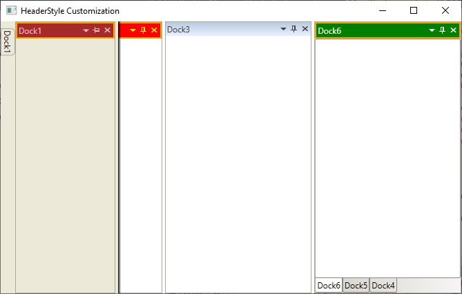

# How-to-set-HeaderStyle-for-individual-dockchild

This sample demonstrates customizing the header of individual dock children in a DockingManager using the [HeaderStyle](https://help.syncfusion.com/cr/wpf/Syncfusion.Windows.Tools.Controls.DockingManager.html#Syncfusion_Windows_Tools_Controls_DockingManager_SetHeaderStyle_System_Windows_DependencyObject_System_Windows_Style_) property. The style applies to docked, auto-hidden, and tabbed windows.

## Requirements

- .NET (WPF)
- Syncfusion WPF controls referenced in the project.

## How it works

- Define a Style targeting Syncfusion:DockHeaderPresenter in Window.Resources.
- Apply it per child using Syncfusion:DockingManager.HeaderStyle.
- Triggers update header appearance on keyboard focus and mouse-over.

## Code snippet

``` xml
<Window.Resources>
        <Style TargetType="Syncfusion:DockHeaderPresenter" x:Key="headerStyle1" >
            <Setter Property="Background" Value="Red"/>
            <Setter Property="Foreground" Value="Yellow"/>
            <Setter Property="BorderBrush" Value="Orange"/>
            <Setter Property="BorderThickness" Value="2"/>
            <Style.Triggers>
                <DataTrigger Binding="{Binding Path=IsTemplateParenKeyboardFocusWithin, RelativeSource={RelativeSource Self}}"
						Value="True">
                    <Setter Property="Foreground" 
						Value="White" />
                    <Setter Property="Background" 
						Value="Green" />
                </DataTrigger>
                <MultiDataTrigger>
                    <MultiDataTrigger.Conditions>
                        <Condition Binding="{Binding Path=IsMouseOver
							       , RelativeSource={RelativeSource Self}}"
						    Value="True" />
                    </MultiDataTrigger.Conditions>
                    <Setter Property="Foreground" 
                        Value="Pink"/>
                    <Setter Property="Background" 
                        Value="Brown"/>
                </MultiDataTrigger>
            </Style.Triggers>
        </Style>
    </Window.Resources>
    <Syncfusion:DockingManager Grid.Row="1" x:Name="dockingManager" DockFill="True">
        <ContentControl Syncfusion:DockingManager.Header="Dock1" Syncfusion:DockingManager.HeaderStyle="{StaticResource headerStyle1}"/>

        <ContentControl Syncfusion:DockingManager.Header="Dock2" Syncfusion:DockingManager.HeaderStyle="{StaticResource headerStyle1}"/>

        <ContentControl Syncfusion:DockingManager.Header="Dock3"/>

        <ContentControl Syncfusion:DockingManager.Header="Dock4" Syncfusion:DockingManager.HeaderStyle="{StaticResource headerStyle1}"/>

        <ContentControl Syncfusion:DockingManager.Header="Dock5" Syncfusion:DockingManager.HeaderStyle="{StaticResource headerStyle1}"/>

        <ContentControl Syncfusion:DockingManager.Header="Dock6" Syncfusion:DockingManager.HeaderStyle="{StaticResource headerStyle1}"/>
    </Syncfusion:DockingManager>
    
```
## Screenshot

The screenshot below displays the header of the dock windows are customized through style of the Header.



## Run the sample
- Open the solution in Visual Studio and run, or
- From the project folder (PowerShell):
  - **Build:** `dotnet build`
  - **Run:** `dotnet run`

## Notes
- Apply different styles per child by referencing different StaticResource keys.
- Triggers change header colors on focus and mouse-over.
- Ensure the Syncfusion namespace xmlns:Syncfusion="http://schemas.syncfusion.com/wpf" is declared.
